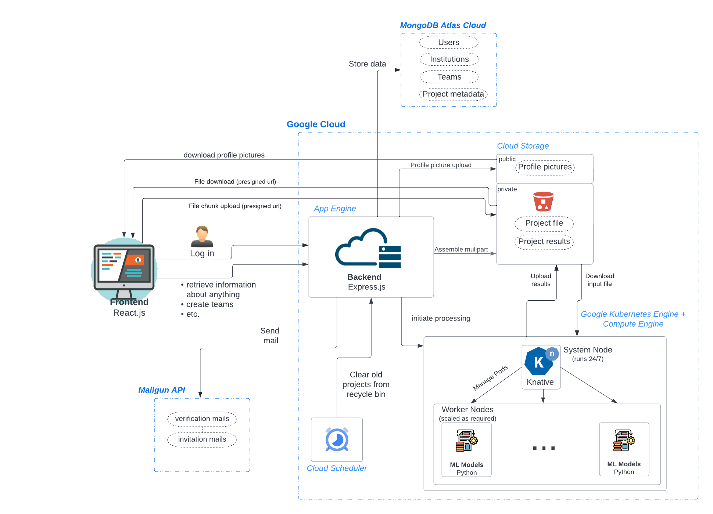

# Architecture Overview

# Main API
The API itself is written in TypeScript and running on a Node.js server using the [express](https://expressjs.com) framework.
It provides the necessary API routes for frontend and acts as an interface to the database and all other services.
The routes are documented with [swagger](https://swagger.io).
A list of all routes can be viewed by opening the `/v1/api-docs` route in a browser.
Additionally, swagger is also used to validate all incoming requests before handling them.

All routes are versioned with `/v1`.

# Authentication
Authentication is realized via JWT tokens.
When logging in via the `/v1/auth` route, this JWT token is returned among other information.
Most of the API routes require an `auth` field in the header, which should contains the JWT token.
This token is used to identify the user who issues a request.

# Database
The server is connected to a MongoDB database in which user information, teams, institutions, projects, etc. are stored. 
The content is provided to frontend via API routes.

# Storage
The Node.js server is also connected to an S3 compatible storage system with multiple buckets. 
For the deployed version on [genecruncher.com](https://genecruncher.com), Google Cloud Storage is used.

## Projects
The users projects are stored on a private bucket. 
The uploading process uses the S3 Multipart Upload, in which larger files can be split into multiple smaller chunks, and each chunk is uploaded separately to a unique url.
This way, if the upload fails at some point, it is only necessary to upload this chunk again.

The chunks themselves are directly uploaded to the bucket from the users browser. 
As the bucket is private, first, a presigned URL has to be requested from the API.
Because the API, is authenticated to the Storage service, it is allowed to create these URLs.
Then, frontend can use this presigned URL and upload the chunk directly to the storage by issuing a PUT request to the presigned URL.
This way, the API server itself doesn't have to process the large query files as they are uploaded from frontend directly into the S3 bucket.

## Recycle bin
For the projects, there also is a recycle bin feature. Projects in the recycle bin which are older than 3 days are deleted completely.

When putting a project into the recycle bin, it is moved to another collection in the Database, and the timestamp of this event is stored in an additional field.
To clean up the recycle bin, there is a cron job running on Google Cloud Scheduler, which issues a GET request to /v1/clean-recyclebin every 12 hours.
Backend then finds and completely deletes all projects which have been in the recycle bin for longer than 3 days.

## Profile pictures
User and institution profile pictures and institution backgrounds are stored in another S3 bucket, which allows read access to the public and write access only to authenticated requests.
For uploading these pictures, there are corresponding API routes.
The maximum file size of the files is limited, and the file type is restricted to PNG or JPEG.

Unlike the projects, the image files are uploaded to the API server first and not directly to the bucket, as it 1. checks the file format and file size and 2. crops the images to be square in the case of profile pictures.
After this processing step, the files are finally uploaded to the S3 bucket from Backend.

## Models and atlases
Information about Models and Atlases are entered by hand into the database, and can be retrieved with respective routes

## Static files
At the moment, the icons for Atlases and the GeneCruncher logo in emails are also hosted on a public S3 storage.

# Control flow with Machine Learning API
The Machine learning code is hosted separately, it just exposes an endpoint to initiate queries (see [scarches-api](../Machine_Learning/scarches-api)).
In the body, Backend specifies all information required for the processing: Model, Atlas, the path to the query in the bucket, the path where the result should be stored in the bucket, ...

The scarches-api has direct access to the S3 Storage and can download the user's queries and upload the results to the private bucket.

When processing of a query has finished, an endpoint of the Backend API is called, which tells the Backend API to delete the query, update the corresponding project in the database, and store the path to the result in the document.
Afterwards, frontend can issue a request to the API, which returns a presigned URL for downloading the result from the private bucket. 

The scarches-api can be hosted on Google Cloud Run or on Google Kubernetes Engine.

# Emails

### Building
As email clients only have very limited HTML + CSS support (especially Outlook and Windows Mail, *Internet Explorer flashbacks*), the [mjml](https://mjml.io) email framework is used to create the emails. 
It uses custom HTML tags for its elements, which are then compiled down to HTML + CSS which is rendered correctly by most clients.

### Sending
For sending of emails, instead of setting up a custom mail server, the [mailgun](https://mailgun.com) API is used, which removes most of the complexity of sending emails.

# Building and Running the project locally

For local development purposes, first run `npm ci` to install all dependencies and then use the `npm run full-backend-local` script, which:
1. Compiles the mjml email templates
2. Starts a [minio](https://min.io) docker instance as a small S3 server + creates two buckets
3. Starts a MongoDB docker instance
4. Runs the typescript compiler + API server in watch mode, so that the server is recompiled and restarted on every code change

This of course requires a running Docker installation.

There are also the following environment variables, which can be configured by creating a `Backend/.env` file with `VAR=VALUE` pairs:
- `PORT`: The port where the API should listen for requests (default: `8050`)
- `DATABASE_URI`: The URL to the mongodb instance: (default: `mongodb://localhost:27017/dev`)
- `CLOUD_RUN_URL`: The URL of the Machine Learning scarches-api (no default)
- `S3_ENDPOINT`: The URL of the S3 server (default: `http://localhost:9000`)
- `S3_BUCKET_NAME`: The name of the private bucket on the S3 server (default: `minio-bucket`)
- `S3_PICTURE_BUCKET_NAME`: The name of the public bucket, where profile pictures etc. should be stored (default: `minio-picture-bucket`)
- `S3_ACCESS_KEY_ID`: The access key id for S3 service (default: `minioadmin`)
- `S3_SECRET_ACCESS_KEY`: The secret access key for S3 service (default: `minioadmin`)
- `MAILGUN_API_KEY`: The API key for the Mailgun API, if not specified, the email content is printed to the console for access to verification links etc. (no default, Mailgun has a sandbox trial for testing purposes)
- `MAIL_DOMAIN`: The domain from which to send the emails (no default)
- `MAILGUN_HOST`: The Mailgun API host (`api.mailgun.net` or `api.eu.mailgun.net`)
- `API_URL`: Public URL of the API itself, used in emails (default: `http://localhost:8050/v1`)
- `FRONTEND_URL`: Public URL of the frontend, used in emails (default: `http://localhost:3000`, default configuration of [Frontend](../Frontend))
- `JWT_SECRET`: The secret which should be used for encoding/decoding the JWT token (default: a random string; unpractical, as after each restart/file modification all previous JWTs are invalid)
- `CONTACT_US`: The email, which should receive the contact us requests. (no default)
- `PROJECT_RECYCLE_BIN_LIFETIME_DAYS`: Number of days projects should stay in the recycle bin, can be decimal number (default: `3`)
- `STATIC_FILES_URL`: The URL where the GeneCruncher logo for emails is hosted (no default)

The custom email build script looks at the content of [`src/views/mails`](./src/views/mails/).
It uses the [`base.html`](./src/views/mails/base.html) as a template which contains the header and footer of the email.
Then it looks for files named `content.mjml.html` in all subdirectories (e.g [`signup_confirm_email`](./src/views/mails/signup_confirm_email/))
It then combines the `base.html` with the `content.mjml.html`, compiles the mjml to standard HTML, and creates a `index.html` file in `build/views/mails/<subdirectory>`.
All other files in the `src/views/mails/<subdirectory>` are simply copied over into the corresponding subdirectories in the build directory.
