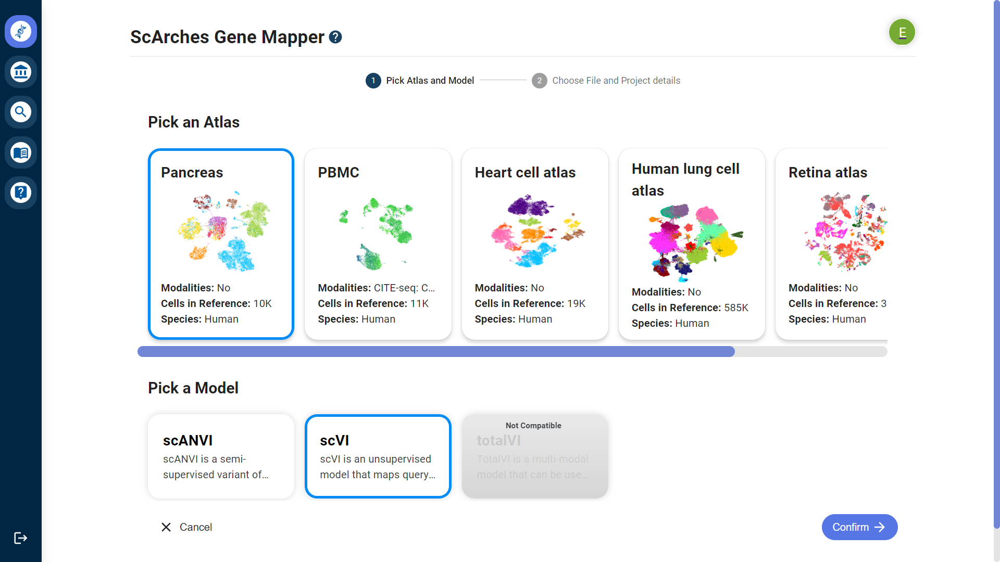
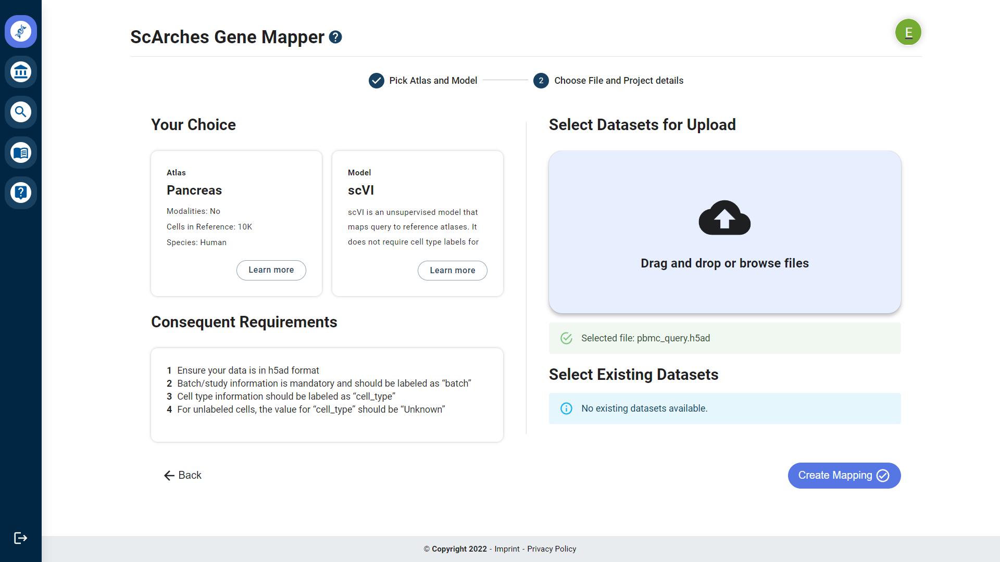

Genecruncher Documentation
=================

Genecruncher helps you visualize all of your single-cell sequencing data in a fast and easy way using neural networks.
The neural networking is done using the scArches package. More information about scArches can be found `here <https://scarches.readthedocs.io/en/latest/>`_.

First steps
---------

First login or sign up using your academic affiliation.

Under the Gene Mapper all of your mappings are displayed. Click on the blue plus button to create a new one.

.. image:: _static/mappings_dashboard.png

Here the Atlas and model type are set, scVI for the Pancreas for example.

On the last page the query datasets are selected. Either upload your own or select one of the existing ones.

Click on "Create Mapping", give it an appropriate name and submit.

A color-coded build status will appear with a progress bar. As soon as it's ready you can click on "See Results".

Here the mapping in the center can be moved and resized via mouse move and scroll, the color-coding modes and selections are toggleable via the Categories tab on the left and on the right the displayed data is visualized in a barchart to display differences between the different batch types and other accumulative values. On the top there are a few buttons to toggle the visability of reference and query data and more.

Links To The Detailed Information Pages
---------
:doc:`Visualization <visualization/index.rst>`
Visualization:
:ref:`vis-index`.

.. toctree::
   :maxdepth: 1
   :caption: Main
   :hidden:

   index.rst
   visualization/index.rst