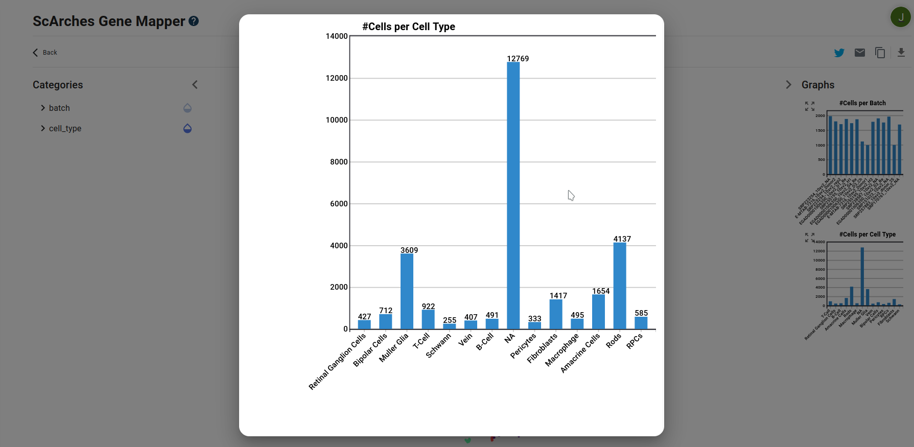

Visualization
=================

General
---------

On the left side, a category panel is displayed. By toggling the arrow button the panel retracts, recentering the model in the center as well.
The categories are generated from the reference and query data and the model visualization is colored depending on the categories. By clicking the waterdrop icons the 
coloring selection is set to the category in question. Each category contains subcategories which can be individually hidden and shown.

.. image:: ../_static/Hide_multipleAttributes.png

The model's name can be found above its visualization, along with a info button for further information.

The visualization is interactable, using click and drag as well as zooming (with either the mouse wheel or the buttons found right below the model's name). The zoom can be reset
by using the rightmost button on the top, as seen in the figure below.
By hovering over the individual cells in the visualization, a tooltip pops up, displaying its subcategory, dependent on the current category selection. 

The visualization can be set to show the query, reference data or both, using the leftmost buttons on the top, as seen in the figure below.

.. image:: ../_static/Hide_Query.png

To the right of the visualization, two graphs are displayed, one for the amount of cells per batch and the other for the amount of cells per type.
The exact value is displayed by hovering over the columns, and by clicking the arrows button the graph is centered and enlarged.
Since there can a large amount of different cell batches, we only show the 14 most common ones in our graphs. Otherwise the graphs would be too cluttered.

Models and workflow
=================

ScArches is a novel deep learning model that enables mapping query to reference datasets. The model allows the user to construct single or multi-modal (CITE-seq) references as well as classifying unlabelled query cells.
Currently, mapping of query to reference datasets is offered on GeneCruncher.

We use a REST-API that allows us to
provide a unified endpoint for the different scarches models to backend
and compute the query file and parse for the visualization.

We support the following models: scVI, scANVI and totalVI.

scVI
---------
The scVI is an unsupervised model and does not require cell type labels for the mapping. Generally, it also takes the least amount of time to train in comparison 
to the other models. scVI maps query to reference atlases.

Workflow: 
To compute the query we first get the already pretrained reference. The pretrained reference is then used to train the user query. By using an already pretrained model
the runtime is greatly shortened. We then compute the latent representation and UMAP which is then displayed on the website.

scANVI
---------
scanVI supports labled and unlabled data and predicts the cell types. Due to that, there is an additional button on the top left (next to the query/reference button) 
that toggles the predicted cells in the visualization.
scANVI is a semi-supervised variant of scVI designed to leverage any available cell state annotations. Compared to unsupervised models, this model will perform better 
integration if cell type labels are partially available in the query.

Workflow:
Just like the scVI workflow we use a pretrained model and predict the unlabled cells' cell type. After that we compute the accuracy of the learned classifier.
The model is finally saved, parsed and its latent representation and UMAP is displayed on the website.

totalVI
---------
totalVI is a multi-modal CITE-seq RNA and protein data model that can be used to map to multi-modal reference atlases.
totalVI takes the most amount of time amongst the models and imputes the proteins that were observed 
(you can color the visualization based on the proteins using the leiden category).

Workflow:
For complex totalVI models a pretrained model is used to save time, which is trained on the reference dataset. The latent representation is saved from the trained data.
We continue using the reference model to perform surgery on it and train the query dataset without protein data. Afterwards we impute protein data into the query
dataset. Finally we get the latent representation of the reference + query dataset and compute the UMAP, which is then displayed on the website.

