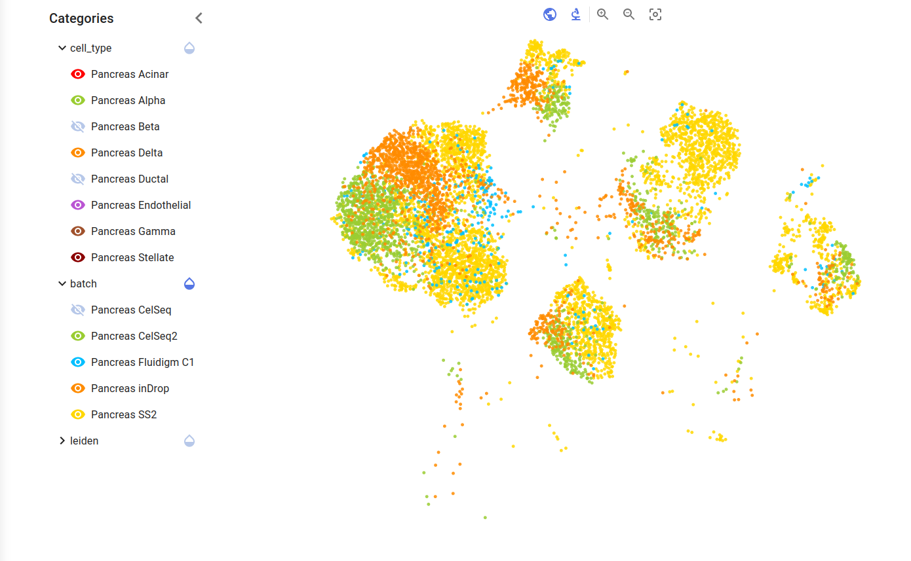
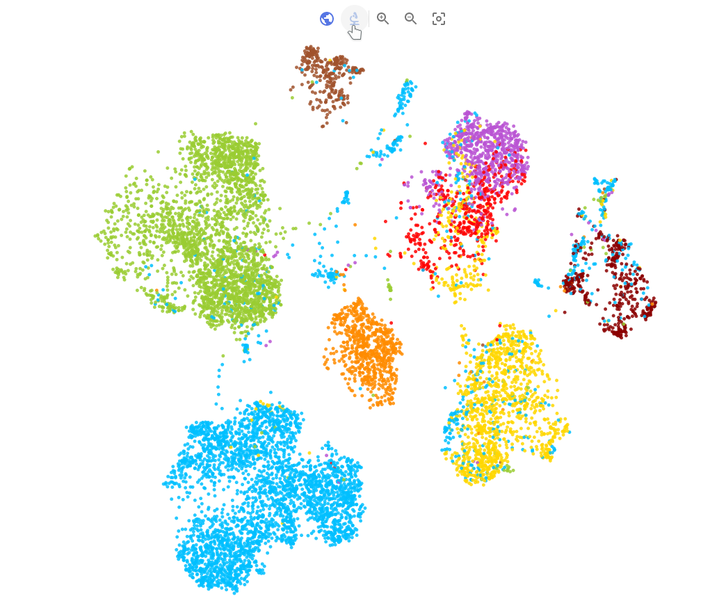

.. _vis-index:
Visualization
=================

General
---------

On the left side, a category panel is displayed. By toggling the arrow button the panel retracts, recentering the model in the center as well.
The categories are generated from the reference and query data and the model visualization is colored depending on the categories. By clicking the waterdrop icons the 
coloring selection is set to the category in question. Each category contains subcategories which can be individually hidden and shown.

The model's name can be found above its visualization, along with a info button for further information.

The visualization is interactable, using click and drag as well as zooming (with either the mouse wheel or the buttons found right below the model's name). The zoom can be reset
by using the rightmost button on the top, as seen in the figure below.
By hovering over the individual cells in the visualization, a tooltip pops up, displaying its subcategory, dependent on the current category selection. 

The visualization can be set to show the query, reference data or both, using the leftmost buttons on the top, as seen in the figure below.

To the right of the visualization, two graphs are displayed, one for the amount of cells per batch and the other for the amount of cells per type.
The exact value is displayed by hovering over the columns, and by clicking the arrows button the graph is centered and enlarged.

scVI
-------

The scVI is an unsupervised model and is used for unlabled cells. Generally, it also takes the least amount of time to train in comparison to the other models.

scanVI
-------

scanVI supports labled and unlabled data and predicts the cell types. Due to that, there is an additional button on the top left (next to the query/reference button) 
that toggles the predicted cells in the visualization.

totalVI
-------

totalVI is a multi-modal CITE-seq RNA and protein data model. totalVI takes the most amount of time amongst the models and imputes the proteins that were observed 
(you can color the visualization based on the proteins using the leiden category).

.. toctree::
    :glob:
    :maxdepth: 2

    *